# Database Schema Reference

> **Status**: IMPLEMENTED — Phase 2/9 Production Schema
> **Source**: `database/prisma/schema.prisma` (886 lines)
> **Models**: 30+ | **Enums**: 20+ | **Migrations**: 9+

---

## Entity Relationship Diagram

```mermaid
erDiagram
    %% Core Auth
    USER ||--|| PROFILE : has
    USER ||--o{ SESSION : owns
    USER ||--o{ USER_ORGANIZATION : belongs_to
    USER ||--o{ USER_SKILL : possesses
    USER ||--o{ PROJECT : owns
    USER ||--o{ TEAM : owns
    USER ||--o{ TEAM_MEMBER : participates_in
    USER ||--o{ PROJECT_MEMBER : participates_in
    USER ||--o{ AI_EXTRACTION_JOB : creates
    USER ||--o{ RESUME : uploads
    USER ||--o{ LEARNING_PLAN : creates
    USER ||--o{ APPLICATION : submits

    %% Skills Taxonomy
    SKILL ||--o{ USER_SKILL : referenced_by
    SKILL ||--o{ SKILL_EVIDENCE : supports
    SKILL ||--o{ PROJECT_SKILL : required_by
    SKILL ||--o{ OPPORTUNITY_SKILL : required_by
    SKILL ||--o{ SKILL_RELATIONSHIP_SOURCE : source
    SKILL ||--o{ SKILL_RELATIONSHIP_TARGET : target
    SKILL ||--o{ SKILL_ALIAS : has
    SKILL ||--o{ LEARNING_RESOURCE : teaches
    SKILL ||--o{ LEARNING_PLAN : targets
    SKILL ||--o{ LEARNING_MILESTONE : milestone_for

    %% Skill Evidence & Intelligence
    USER_SKILL ||--o{ SKILL_EVIDENCE : evidenced_by

    %% Projects & Teams
    PROJECT ||--o{ PROJECT_SKILL : requires
    PROJECT ||--o{ PROJECT_MEMBER : has_members
    TEAM ||--o{ TEAM_MEMBER : has_members

    %% Organizations (Multi-tenancy)
    ORGANIZATION ||--o{ USER_ORGANIZATION : contains
    ORGANIZATION ||--o{ TEAM : contains
    ORGANIZATION ||--o{ OPPORTUNITY : posts
    ORGANIZATION ||--o{ SKILL : scopes
    ORGANIZATION ||--o{ PROJECT : scopes
    ORGANIZATION ||--o{ LEARNING_RESOURCE : scopes
    ORGANIZATION ||--o{ RESUME : scopes

    %% Opportunities & Applications
    OPPORTUNITY ||--o{ OPPORTUNITY_SKILL : requires
    OPPORTUNITY ||--o{ APPLICATION : receives

    %% Resumes & AI
    RESUME ||--|| RESUME_ANALYSIS : has
    AI_EXTRACTION_JOB ||--o{ AI_EXTRACTION_RESULT : produces

    %% Learning
    LEARNING_PLAN ||--o{ LEARNING_MILESTONE : has_steps
```



---

## Core Models

### User & Auth

| Model | Description | Key Fields |
|-------|-------------|------------|
| `User` | Account identity | `id`, `email` (unique), `username` (unique), `passwordHash`, `role`, `status`, `lastLoginAt`, `defaultOrgId` |
| `Profile` | Public profile info | `id`, `userId` (unique), `firstName`, `lastName`, `displayName`, `bio`, `headline`, `location`, `profileImageUrl`, `websiteUrl`, `visibility` |
| `Session` | Auth session (7-day) | `id`, `userId`, `token` (unique), `expiresAt` |
| `UserOrganization` | Tenant membership | `id`, `userId`, `organizationId`, `role` (ORG_ADMIN/MEMBER/VIEWER) |

### Skill Taxonomy

| Model | Description | Key Fields |
|-------|-------------|------------|
| `Skill` | Normalized skill catalog | `id`, `name`, `slug` (unique per org), `description`, `category`, `subcategory`, `iconUrl`, `isVerified`, `demandLevel`, `organizationId` (nullable) |
| `SkillAlias` | Alternative names | `id`, `skillId`, `alias`, `normalizedAlias` (unique per skill) |
| `SkillRelationship` | Graph edges | `id`, `sourceSkillId`, `targetSkillId`, `type`, `strength` (0-1) |

### User Skills & Evidence

| Model | Description | Key Fields |
|-------|-------------|------------|
| `UserSkill` | User's skill claim | `id`, `userId`, `skillId`, `proficiencyLevel`, `yearsOfExperience`, `confidence` (0-100), `verificationStatus`, `verificationMethod`, `verifiedAt`, `verifiedBy`, `lastUsedAt` |
| `SkillEvidence` | Proof of skill | `id`, `userSkillId`, `skillId` (nullable), `type`, `title`, `description`, `url`, `metadata` (JSON), `verifiedAt`, `verifiedBy` |

### Projects & Teams

| Model | Description | Key Fields |
|-------|-------------|------------|
| `Project` | Portfolio project | `id`, `ownerId`, `title`, `slug`, `description`, `longDescription`, `status`, `visibility`, `repositoryUrl`, `liveUrl`, `documentationUrl`, `thumbnailUrl`, `startDate`, `endDate`, `organizationId` |
| `ProjectSkill` | Project-skill link | `id`, `projectId`, `skillId` |
| `ProjectMember` | Collaborators | `id`, `userId`, `projectId`, `role` (OWNER/ADMIN/MEMBER/VIEWER) |
| `Team` | Group within org | `id`, `name`, `slug`, `description`, `ownerId`, `organizationId`, `avatarUrl`, `isPublic` |
| `TeamMember` | Team membership | `id`, `userId`, `teamId`, `role` (OWNER/ADMIN/MEMBER) |

### Opportunities & Applications

| Model | Description | Key Fields |
|-------|-------------|------------|
| `Opportunity` | Job/internship/project | `id`, `organizationId`, `title`, `description`, `type`, `status`, `location`, `isRemote`, `salaryMin`, `salaryMax`, `currency`, `applicationDeadline`, `requirements` (JSON), `benefits` (JSON) |
| `OpportunitySkill` | Required skills | `id`, `opportunityId`, `skillId`, `isRequired` |
| `Application` | User application | `id`, `userId`, `opportunityId`, `status`, `coverLetter`, `resumeId`, `appliedAt`, `reviewedAt`, `reviewedBy` |

### AI & Resume Intelligence

| Model | Description | Key Fields |
|-------|-------------|------------|
| `AIExtractionJob` | Extraction request | `id`, `userId`, `inputText`, `inputTextHash`, `status`, `providerType`, `model`, `inputTokens`, `outputTokens`, `latencyMs`, `errorMessage` |
| `AIExtractionResult` | Extracted skill | `id`, `jobId`, `skillName`, `skillSlug`, `matchedSkillId`, `isMatched`, `confidence`, `evidenceSnippet`, `reasoning` |
| `Resume` | Uploaded file | `id`, `userId`, `originalFilename`, `storageKey`, `fileType`, `fileSize`, `status`, `mimeType`, `organizationId` |
| `ResumeAnalysis` | Parsed results | `id`, `resumeId` (unique), `status`, `model`, `providerType`, `personalInfo` (JSON), `summary`, `skills` (JSON), `experiences` (JSON), `education` (JSON), `projects` (JSON), `certifications` (JSON), `duplicateFlags` (JSON) |

### Learning

| Model | Description | Key Fields |
|-------|-------------|------------|
| `LearningResource` | Course/book/video | `id`, `title`, `description`, `url`, `provider`, `type`, `skillId`, `difficulty`, `language`, `durationMinutes`, `rating`, `qualityScore`, `verifiedSource`, `lastCheckedAt`, `organizationId` |
| `LearningPlan` | User's plan | `id`, `userId`, `targetSkillId`, `status`, `currentMilestone`, `completedAt` |
| `LearningMilestone` | Plan step | `id`, `planId`, `skillId`, `order`, `targetProficiency`, `status`, `completedAt` |

---

## Enums (20+)

### User & Auth
```prisma
enum UserStatus { ACTIVE, INACTIVE, SUSPENDED, PENDING_VERIFICATION }
enum UserRole { SUPER_ADMIN, ADMIN, FACULTY, PLACEMENT_OFFICER, STUDENT, RECRUITER, ALUMNI }
enum OrgUserRole { ORG_ADMIN, MEMBER, VIEWER }
enum ProfileVisibility { PUBLIC, PRIVATE, CONNECTIONS_ONLY }
```

### Skills
```prisma
enum ProficiencyLevel { BEGINNER, INTERMEDIATE, ADVANCED, EXPERT }
enum VerificationStatus { UNVERIFIED, PENDING, VERIFIED, REJECTED }
enum VerificationMethod { SELF_REPORTED, PEER_ENDORSED, CERTIFICATION, PROJECT_DEMONSTRATED, ASSESSMENT_PASSED, EMPLOYER_VERIFIED }
enum SkillCategory { PROGRAMMING, DATA_SCIENCE, DESIGN, MARKETING, PRODUCT, MANAGEMENT, SALES, OPERATIONS, FINANCE, HR, LEGAL, OTHER }
enum DemandLevel { LOW, MEDIUM, HIGH, CRITICAL }
enum EvidenceType { PROJECT, CERTIFICATE, PORTFOLIO_ITEM, WORK_EXPERIENCE, ASSESSMENT_RESULT, SELF_REPORTED, OTHER }
enum SkillRelationshipType { PREREQUISITE, RELATED, SUBSKILL, SPECIALIZATION, COMPLEMENTARY }
```

### Projects & Teams
```prisma
enum ProjectStatus { PLANNING, IN_PROGRESS, REVIEW, COMPLETED, ARCHIVED, CANCELLED }
enum ProjectVisibility { PUBLIC, PRIVATE, TEAM, ORGANIZATION }
enum ProjectRole { OWNER, ADMIN, MEMBER, VIEWER }
enum TeamRole { OWNER, ADMIN, MEMBER }
```

### Organizations
```prisma
enum OrganizationType { COMPANY, EDUCATIONAL, NON_PROFIT, GOVERNMENT, COMMUNITY, OTHER }
enum OrganizationStatus { ACTIVE, INACTIVE, PENDING_VERIFICATION }
enum OrganizationSize { STARTUP, SMALL, MEDIUM, LARGE, ENTERPRISE }
```

### Opportunities
```prisma
enum OpportunityType { JOB, INTERNSHIP, FREELANCE, PROJECT, COMPETITION, LEARNING, OTHER }
enum OpportunityStatus { DRAFT, OPEN, CLOSED, FILLED, CANCELLED, EXPIRED }
enum ApplicationStatus { APPLIED, SCREENING, INTERVIEW, OFFER, HIRED, REJECTED, WITHDRAWN }
```

### AI & Resume
```prisma
enum AIExtractionStatus { PENDING, PROCESSING, COMPLETED, FAILED, CANCELLED }
enum AIProviderType { OPENAI, ANTHROPIC, LOCAL, CUSTOM }
enum ResumeStatus { UPLOADED, PROCESSING, READY, FAILED, DELETED }
enum ResumeAnalysisStatus { PENDING, PROCESSING, COMPLETED, FAILED, CANCELLED }
enum ResumeFileType { PDF, DOCX, TXT }
```

### Learning
```prisma
enum LearningResourceType { COURSE, BOOK, VIDEO, DOCUMENTATION, ARTICLE, PROJECT, TUTORIAL }
enum ResourceDifficulty { BEGINNER, INTERMEDIATE, ADVANCED, EXPERT }
enum LearningPlanStatus { ACTIVE, COMPLETED, ARCHIVED, PAUSED }
```

### Other
```prisma
enum DuplicateDetectionStatus { NONE, POSSIBLE_DUPLICATE, CONFIRMED_DUPLICATE }
```

---

## Key Indexes

| Model | Indexes |
|-------|---------|
| `User` | `email`, `username`, `status`, `defaultOrgId` |
| `Session` | `userId`, `token`, `expiresAt` |
| `Skill` | `organizationId`, `slug`, `category` |
| `UserSkill` | `userId`, `skillId`, `proficiencyLevel`, `verificationStatus` |
| `SkillEvidence` | `userSkillId`, `skillId`, `type` |
| `SkillRelationship` | `sourceSkillId`, `targetSkillId`, `type` |
| `Project` | `ownerId`, `organizationId`, `slug`, `status`, `visibility` |
| `ProjectSkill` | `projectId`, `skillId` |
| `Opportunity` | `organizationId`, `type`, `status`, `isRemote`, `applicationDeadline` |
| `AIExtractionJob` | `userId`, `status`, `inputTextHash` |
| `Resume` | `userId`, `organizationId`, `status` |
| `LearningResource` | `skillId`, `organizationId`, `type`, `difficulty`, `verifiedSource` |
| `LearningPlan` | `userId`, `targetSkillId`, `status` |

---

## Cascade Behavior

| Relationship | On Delete |
|--------------|-----------|
| User → Profile | CASCADE |
| User → UserSkill | CASCADE |
| User → Project (owner) | CASCADE |
| User → Team (owner) | CASCADE |
| User → Session | CASCADE |
| User → AIExtractionJob | CASCADE |
| User → Resume | CASCADE |
| User → LearningPlan | CASCADE |
| User → Application | CASCADE |
| Organization → Team | SET NULL |
| Organization → Opportunity | SET NULL |
| Organization → Skill | CASCADE |
| Organization → Project | SET NULL |
| Organization → LearningResource | CASCADE |
| Skill → UserSkill | CASCADE |
| Skill → ProjectSkill | CASCADE |
| Skill → OpportunitySkill | CASCADE |
| Skill → SkillEvidence | CASCADE |
| Skill → SkillRelationship (source/target) | CASCADE |
| Project → ProjectSkill | CASCADE |
| Project → ProjectMember | CASCADE |
| Resume → ResumeAnalysis | CASCADE |
| LearningPlan → LearningMilestone | CASCADE |

---

## Soft Deletes

Models with `deletedAt` (soft delete):
- `User`, `Skill`, `Organization`, `Project`, `Opportunity`, `Resume`, `LearningResource`

Query with: `prisma.user.findMany({ where: { deletedAt: null } })`

---

## Multi-Tenancy Design (Phase 9 Foundation)

```
Organization (Tenant Root)
├── UserOrganization (members + roles)
├── Skill (organizationId nullable → global or tenant-scoped)
├── Project (organizationId nullable)
├── Team (organizationId nullable)
├── Opportunity (organizationId nullable)
├── LearningResource (organizationId nullable)
├── Resume (organizationId nullable)
└── User.defaultOrgId (single-org context)
```

**Query Pattern:**
```typescript
// Tenant-scoped skill query
const skills = await prisma.skill.findMany({
  where: { organizationId: user.defaultOrgId },
});

// Global skills (organizationId = null)
const globalSkills = await prisma.skill.findMany({
  where: { organizationId: null },
});
```

---

## Migration History

| Migration | Description |
|-----------|-------------|
| `20250109000000_init` | Core models (User, Profile, Skill, UserSkill, Project, Team, Organization, Opportunity) |
| `20250110000001_skill_intelligence` | SkillEvidence, SkillRelationship, SELF_REPORTED evidence type |
| `20250115000000_auth` | Session, passwordHash, UserStatus, Auth indexes |
| `20250120000000_ai_extraction` | AIExtractionJob, AIExtractionResult, SkillAlias |
| `20250125000000_resume` | Resume, ResumeAnalysis, ResumeFileType, ResumeStatus |
| `20250201000000_learning` | LearningResource, LearningPlan, LearningMilestone, LearningResourceType, ResourceDifficulty |
| `20250210000000_multi_tenancy` | Organization, UserOrganization, OrgUserRole, orgId on scoped models |
| `20250215000000_opportunities` | Opportunity, OpportunitySkill, Application, ApplicationStatus |
| `20250220000000_skill_graph_enhancements` | SkillRelationship strength, SkillGap, LearningPath fields |

---

## Seed Data (Development)

Run: `npm run db:seed`

| Entity | Count | Details |
|--------|-------|---------|
| Skills | 10 | TypeScript, React, Node.js, PostgreSQL, Python, AWS, Docker, UI Design, Project Management, Machine Learning |
| Users | 1 | `dev@skillsync.local` / `devuser` (ACTIVE) |
| Profiles | 1 | "Dev User", Full-stack Developer |
| UserSkills | 5 | TS(EXPERT,95%), React(ADV,90%), Node(ADV,85%), PG(INTER,80%), AWS(INTER,75%) |
| SkillEvidence | 3 | 2 Projects, 1 Certificate |
| Organizations | 1 | SkillSync (COMPANY, STARTUP) |
| Projects | 2 | SkillSync Platform (IN_PROGRESS), Dashboard (COMPLETED) |
| Teams | 1 | Core Team |
| Opportunities | 3 | Senior Engineer (JOB), Frontend Intern (INTERNSHIP), OSS Contributor (PROJECT) |

---

## Query Patterns

### Get User's Skill Intelligence
```typescript
const userSkills = await prisma.userSkill.findMany({
  where: { userId },
  include: {
    skill: true,
    evidence: true,
  },
});
```

### Skill Gap Analysis
```typescript
// 1. Get target skill prerequisites
const prereqs = await prisma.skillRelationship.findMany({
  where: { targetSkillId, type: 'PREREQUISITE' },
  include: { sourceSkill: true },
});

// 2. Get user's skills
const userSkills = await prisma.userSkill.findMany({
  where: { userId, skillId: { in: prereqs.map(p => p.sourceSkillId) } },
});

// 3. Classify: KNOWN / PARTIAL / MISSING / FOUNDATION_REQUIRED
```

### Learning Path Generation
```typescript
// Topological sort of prerequisites
// Create milestones with target proficiency
// Fetch LearningResources per prerequisite skill
```

---

## Storage Requirements

| Data Type | Storage | Notes |
|-----------|---------|-------|
| Resume files | S3 / Local FS | `storageKey` in Resume model |
| Profile images | S3 / Local FS | `profileImageUrl` in Profile |
| Project thumbnails | S3 / Local FS | `thumbnailUrl` in Project |
| AI extraction cache | PostgreSQL | `inputTextHash` for deduplication |
| Session tokens | PostgreSQL | 7-day TTL, auto-cleanup needed |

---

## Performance Considerations

1. **Connection Pooling** — Use PgBouncer for >100 concurrent connections
2. **Read Replicas** — Route skill catalog, learning resource queries to replicas
3. **Composite Indexes** — Add for common query patterns (e.g., `userId + status`)
4. **Materialized Views** — Consider for skill intelligence summaries
5. **Partitioning** — `AIExtractionJob` by date for high volume
6. **JSON Fields** — Use `Json` type for flexible metadata; validate at app layer