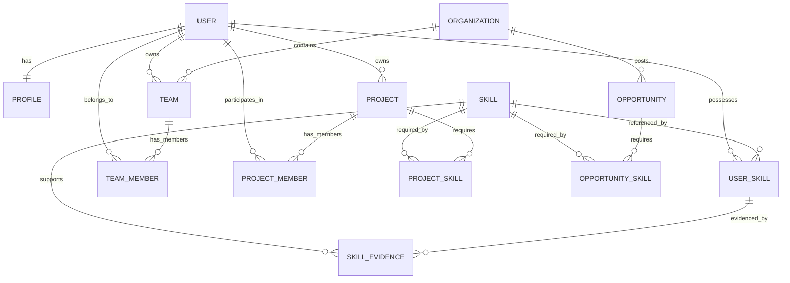

# SkillSync Database Architecture

## Overview

This document describes the Phase 2 production database architecture for SkillSync, implemented with PostgreSQL and Prisma ORM.

## Entity Relationship Diagram



## Core Models

### User
Represents an account in the system.

| Field | Type | Constraints |
|-------|------|-------------|
| id | String (CUID) | Primary Key |
| email | String | Unique, Indexed |
| username | String? | Unique, Indexed |
| passwordHash | String? | Not stored in plaintext |
| status | UserStatus | Default: PENDING_VERIFICATION |
| lastLoginAt | DateTime? | |
| createdAt | DateTime | Auto-generated |
| updatedAt | DateTime | Auto-updated |
| deletedAt | DateTime? | Soft delete |

**Indexes:** email, username, status

### Profile
Separate entity for user profile information (1:1 with User).

| Field | Type | Constraints |
|-------|------|-------------|
| id | String (CUID) | Primary Key |
| userId | String | Unique, Foreign Key → User |
| firstName | String? | |
| lastName | String? | |
| displayName | String? | |
| bio | String? | |
| headline | String? | |
| location | String? | |
| profileImageUrl | String? | |
| websiteUrl | String? | |
| visibility | ProfileVisibility | Default: PUBLIC |
| createdAt | DateTime | Auto-generated |
| updatedAt | DateTime | Auto-updated |

**Indexes:** userId

### Skill
Normalized skill catalog.

| Field | Type | Constraints |
|-------|------|-------------|
| id | String (CUID) | Primary Key |
| name | String | Unique |
| slug | String | Unique, Indexed |
| description | String? | |
| category | SkillCategory | |
| subcategory | String? | |
| iconUrl | String? | |
| isVerified | Boolean | Default: false |
| demandLevel | DemandLevel | Default: MEDIUM |
| createdAt | DateTime | Auto-generated |
| updatedAt | DateTime | Auto-updated |
| deletedAt | DateTime? | Soft delete |

**Indexes:** slug, category

### UserSkill
Many-to-many relationship between User and Skill with proficiency tracking.

| Field | Type | Constraints |
|-------|------|-------------|
| id | String (CUID) | Primary Key |
| userId | String | Foreign Key → User (Cascade) |
| skillId | String | Foreign Key → Skill (Cascade) |
| proficiencyLevel | ProficiencyLevel | Default: BEGINNER |
| yearsOfExperience | Float? | |
| confidence | Int? | Default: 50 (0-100) |
| verificationStatus | VerificationStatus | Default: UNVERIFIED |
| verificationMethod | VerificationMethod? | |
| verifiedAt | DateTime? | |
| verifiedBy | String? | |
| lastUsedAt | DateTime? | |
| createdAt | DateTime | Auto-generated |
| updatedAt | DateTime | Auto-updated |

**Constraints:** Unique(userId, skillId)
**Indexes:** userId, skillId, proficiencyLevel, verificationStatus

### SkillEvidence
Evidence supporting a user's skill claim.

| Field | Type | Constraints |
|-------|------|-------------|
| id | String (CUID) | Primary Key |
| userSkillId | String | Foreign Key → UserSkill (Cascade) |
| skillId | String? | Foreign Key → Skill (SetNull) |
| type | EvidenceType | |
| title | String | |
| description | String? | |
| url | String? | |
| metadata | Json? | Flexible additional data |
| verifiedAt | DateTime? | |
| verifiedBy | String? | |
| createdAt | DateTime | Auto-generated |
| updatedAt | DateTime | Auto-updated |

**Indexes:** userSkillId, skillId, type

### Project
User-owned projects for portfolio and evidence.

| Field | Type | Constraints |
|-------|------|-------------|
| id | String (CUID) | Primary Key |
| ownerId | String | Foreign Key → User (Cascade) |
| title | String | |
| slug | String | |
| description | String | |
| longDescription | String? | |
| status | ProjectStatus | Default: PLANNING |
| visibility | ProjectVisibility | Default: PUBLIC |
| repositoryUrl | String? | |
| liveUrl | String? | |
| documentationUrl | String? | |
| thumbnailUrl | String? | |
| startDate | DateTime? | |
| endDate | DateTime? | |
| createdAt | DateTime | Auto-generated |
| updatedAt | DateTime | Auto-updated |
| deletedAt | DateTime? | Soft delete |

**Constraints:** Unique(ownerId, slug)
**Indexes:** ownerId, slug, status, visibility

### ProjectSkill
Many-to-many between Project and Skill.

| Field | Type | Constraints |
|-------|------|-------------|
| id | String (CUID) | Primary Key |
| projectId | String | Foreign Key → Project (Cascade) |
| skillId | String | Foreign Key → Skill (Cascade) |
| createdAt | DateTime | Auto-generated |

**Constraints:** Unique(projectId, skillId)
**Indexes:** projectId, skillId

### ProjectMember
Project collaboration membership.

| Field | Type | Constraints |
|-------|------|-------------|
| id | String (CUID) | Primary Key |
| userId | String | Foreign Key → User (Cascade) |
| projectId | String | Foreign Key → Project (Cascade) |
| role | ProjectRole | Default: MEMBER |
| joinedAt | DateTime | Auto-generated |

**Constraints:** Unique(userId, projectId)
**Indexes:** userId, projectId

### Organization
Companies, educational institutions, communities, etc.

| Field | Type | Constraints |
|-------|------|-------------|
| id | String (CUID) | Primary Key |
| name | String | |
| slug | String | Unique, Indexed |
| description | String? | |
| logoUrl | String? | |
| websiteUrl | String? | |
| type | OrganizationType | Default: COMPANY |
| status | OrganizationStatus | Default: ACTIVE |
| size | OrganizationSize? | |
| industry | String? | |
| headquarters | String? | |
| createdAt | DateTime | Auto-generated |
| updatedAt | DateTime | Auto-updated |
| deletedAt | DateTime? | Soft delete |

**Indexes:** slug, type, status

### Team
Groups within or across organizations.

| Field | Type | Constraints |
|-------|------|-------------|
| id | String (CUID) | Primary Key |
| name | String | |
| slug | String | |
| description | String? | |
| ownerId | String | Foreign Key → User (Cascade) |
| organizationId | String? | Foreign Key → Organization (SetNull) |
| avatarUrl | String? | |
| isPublic | Boolean | Default: true |
| createdAt | DateTime | Auto-generated |
| updatedAt | DateTime | Auto-updated |

**Constraints:** Unique(ownerId, slug)
**Indexes:** ownerId, organizationId

### TeamMember
Team membership.

| Field | Type | Constraints |
|-------|------|-------------|
| id | String (CUID) | Primary Key |
| userId | String | Foreign Key → User (Cascade) |
| teamId | String | Foreign Key → Team (Cascade) |
| role | TeamRole | Default: MEMBER |
| joinedAt | DateTime | Auto-generated |

**Constraints:** Unique(userId, teamId)
**Indexes:** userId, teamId

### Opportunity
Jobs, internships, freelance gigs, competitions, learning opportunities.

| Field | Type | Constraints |
|-------|------|-------------|
| id | String (CUID) | Primary Key |
| organizationId | String? | Foreign Key → Organization (SetNull) |
| title | String | |
| description | String | |
| type | OpportunityType | |
| status | OpportunityStatus | Default: DRAFT |
| location | String? | |
| isRemote | Boolean | Default: false |
| salaryMin | Int? | |
| salaryMax | Int? | |
| currency | String? | Default: USD |
| applicationDeadline | DateTime? | |
| requirements | Json? | Flexible structured data |
| benefits | Json? | Flexible structured data |
| createdAt | DateTime | Auto-generated |
| updatedAt | DateTime | Auto-updated |
| deletedAt | DateTime? | Soft delete |

**Indexes:** organizationId, type, status, isRemote, applicationDeadline

### OpportunitySkill
Many-to-many between Opportunity and Skill with requirement flag.

| Field | Type | Constraints |
|-------|------|-------------|
| id | String (CUID) | Primary Key |
| opportunityId | String | Foreign Key → Opportunity (Cascade) |
| skillId | String | Foreign Key → Skill (Cascade) |
| isRequired | Boolean | Default: true |
| createdAt | DateTime | Auto-generated |

**Constraints:** Unique(opportunityId, skillId)
**Indexes:** opportunityId, skillId

## Enums

### UserStatus
- ACTIVE
- INACTIVE
- SUSPENDED
- PENDING_VERIFICATION

### ProfileVisibility
- PUBLIC
- PRIVATE
- CONNECTIONS_ONLY

### ProficiencyLevel
- BEGINNER
- INTERMEDIATE
- ADVANCED
- EXPERT

### VerificationStatus
- UNVERIFIED
- PENDING
- VERIFIED
- REJECTED

### SkillCategory
- PROGRAMMING
- DATA_SCIENCE
- DESIGN
- MARKETING
- PRODUCT
- MANAGEMENT
- SALES
- OPERATIONS
- FINANCE
- HR
- LEGAL
- OTHER

### DemandLevel
- LOW
- MEDIUM
- HIGH
- CRITICAL

### ProjectStatus
- PLANNING
- IN_PROGRESS
- REVIEW
- COMPLETED
- ARCHIVED
- CANCELLED

### ProjectVisibility
- PUBLIC
- PRIVATE
- TEAM
- ORGANIZATION

### OrganizationType
- COMPANY
- EDUCATIONAL
- NON_PROFIT
- GOVERNMENT
- COMMUNITY
- OTHER

### OrganizationStatus
- ACTIVE
- INACTIVE
- PENDING_VERIFICATION

### OpportunityType
- JOB
- INTERNSHIP
- FREELANCE
- PROJECT
- COMPETITION
- LEARNING
- OTHER

### OpportunityStatus
- DRAFT
- OPEN
- CLOSED
- FILLED
- CANCELLED
- EXPIRED

### TeamRole
- OWNER
- ADMIN
- MEMBER

### ProjectRole
- OWNER
- ADMIN
- MEMBER
- VIEWER

### OrganizationSize
- STARTUP
- SMALL
- MEDIUM
- LARGE
- ENTERPRISE

### VerificationMethod
- SELF_REPORTED
- PEER_ENDORSED
- CERTIFICATION
- PROJECT_DEMONSTRATED
- ASSESSMENT_PASSED
- EMPLOYER_VERIFIED

### EvidenceType
- PROJECT
- CERTIFICATE
- PORTFOLIO_ITEM
- WORK_EXPERIENCE
- ASSESSMENT_RESULT
- OTHER

## Design Decisions

### 1. Separate Profile Entity
User authentication data (email, password hash, status) is separated from profile data (name, bio, location, etc.) to:
- Allow profiles to exist without authentication (future OAuth)
- Keep sensitive auth data isolated
- Enable different visibility controls per profile field

### 2. Explicit UserSkill Model
Rather than a simple many-to-many, UserSkill is an explicit model to store:
- Proficiency level (4-tier enum)
- Years of experience
- Confidence score (0-100)
- Verification workflow (status, method, timestamp, verifier)
- Last used timestamp for skill freshness

### 3. Flexible SkillEvidence
Evidence is polymorphic via EvidenceType enum and JSON metadata, allowing:
- Projects as evidence (link to Project model)
- Certificates (issuer, expiration in metadata)
- Portfolio items (URLs, thumbnails in metadata)
- Work experience (company, role, dates in metadata)
- Assessment results (score, percentile in metadata)

### 4. Project-Skill Many-to-Many
Projects require multiple skills; skills appear in multiple projects. Explicit ProjectSkill model allows future extensions (proficiency required, role in project).

### 5. Organization as First-Class Entity
Organizations are independent entities that can:
- Post opportunities
- Contain teams
- Be verified independently
- Have types (company, educational, non-profit, etc.)

### 6. Soft Deletes
Models with `deletedAt` support soft deletion for:
- Data recovery
- Audit trails
- Referential integrity (avoid cascade delete surprises)

### 5. Cascade Behavior
- User → Profile: CASCADE (profile meaningless without user)
- User → UserSkill: CASCADE (skills tied to user)
- User → Project: CASCADE (owner's projects deleted with user)
- User → Team: CASCADE (owner's teams deleted)
- Organization → Team: SET NULL (team survives org deletion)
- Organization → Opportunity: SET NULL (opportunity survives org deletion)
- Skill → UserSkill: CASCADE (skill removal removes user associations)
- Skill → ProjectSkill: CASCADE
- Skill → OpportunitySkill: CASCADE

### 6. Indexing Strategy
Indexes on:
- All foreign keys (query performance)
- Unique constraints (email, username, slugs)
- Status fields (filtering)
- Category/type fields (categorization queries)
- Deadlines (time-based queries)

## Migration Workflow

```bash
# Create new migration
npm run db:migrate -- --name migration_name

# Apply migrations in development
npm run db:migrate

# Deploy migrations in production
npm run db:migrate:deploy

# Generate Prisma client after schema changes
npm run db:generate

# View database in browser
npm run db:studio
```

## Seed Workflow

```bash
# Run development seed
npm run db:seed
```

The seed creates:
- 10 verified skills across categories
- 1 development user with profile
- 5 user skills with varying proficiency
- 3 skill evidence records
- 1 organization (SkillSync)
- 2 projects with skill links
- 1 team with owner
- 3 opportunities (job, internship, open-source project)

All seed data is clearly marked as development/demo data.

## Database Health Checks

Two health endpoints:
- `GET /health` - Application health (no DB)
- `GET /health/db` - Database connectivity (executes `SELECT 1`)

## Security Considerations

- Password hashes never stored in plaintext (placeholder in seed)
- Soft deletes prevent accidental data loss
- Cascade deletes only where semantically correct
- Unique constraints prevent duplicate data
- JSON fields use structured validation at application layer
- No secrets in schema or seed files

## Future Extensions

The schema supports future features without redesign:
- Skill assessments → Assessment model linking to UserSkill
- Recommendations → Recommendation model with User/Opportunity/Skill
- Messaging → Message/Conversation models with User foreign keys
- Notifications → Notification model with User foreign key
- Analytics → Event/Metric models with polymorphic references
- Gamification → Achievement/Badge models with User foreign keys
- AI insights → Insight model with User/Skill/Opportunity references